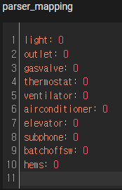

# 애드온 설정 방법
앱 구동에 필요한 파라미터들을 HA 애드온 `구성`에서 설정할 수 있다

### MQTT 브로커 설정

```yaml
mqtt_broker:
  host: core-mosquitto
  port: 1883
  username: username
  password: password
```
- host: MQTT 브로커 호스트 주소 (ip주소 혹은 dns)
- port: MQTT 브로커 TCP 포트 번호 (default 1883)
- username: MQTT 브로커 접속 계정
- password: MQTT 브로커 계정 패스워드

`NOTE`: HA의 [mosquitto 애드온](https://github.com/home-assistant/addons/tree/master/mosquitto)을 사용하지 않을 경우 host를 적절하게 수정해줘야 한다<br>
`TODO`: ssl 보안 접속 기능은 향후 추가 예정<br>

### RS-485 컨버터 설정

```yaml
rs485:
  - name: port1
    index: 0
    enable: true
    hwtype: 0
    packettype: 0
    serial: /dev/ttyUSB0
    baudrate: 9600
    databit: 8
    parity: "N"
    stopbits: 1
    socketaddr: 127.0.0.1
    socketport: 8899
```
- name: 컨버터 이름 (로그에 찍히는 이름), 아무렇게나 임의로 정하면 됨
- index: 0부터 시작해 컨버터 순서대로 1씩 증가해야 함, 기기간 중복되면 안됨
- enable: `false` 설정 시 해당 컨버터는 동작하지 않음
- hwtype: 
  - `0`일 경우 **USB-to-RS485** 컨버터 (PC와 연결된 기기) <br>
    아래 설정들만 유효하게 적용된다
    - serial: 디바이스 이름 (ex: /dev/ttyUSB0)
    - baudrate: 보레이트 (9600, 115200 등)
    - databit: 데이터비트 (5, 6, 7, 8 중 하나의 값)
    - parity: 패리티비트 ("N", "O", "E" 중 하나의 문자)
    - stopbits: 스탑비트 (1, 1.5, 2 중 하나의 값)
  - `1`일 경우 EW-11과 같은 네트워크 소켓 통신 타입 컨버터 <br>
    아래 설정들만 유효하게 적용됨
    - socketaddr: 기기의 IP 주소
    - socketport: 기기의 TCP 포트 번호
- packettype: `0` (`1`일 경우 주방 비디오폰용으로 사용해야 함)

`NOTE`: 와이파이 컨버터의 경우 현재 TCP 소켓 통신만 지원함
`NOTE`: 2개 이상의 컨버터를 사용하고자 하는 경우 설정을 아래와 같이 추가해줘야 함
  ```yaml
  rs485:
    - name: port1
      index: 0
      enable: true
      hwtype: 0
      packettype: 0
      serial: /dev/ttyUSB0
      baudrate: 9600
      databit: 8
      parity: "N"
      stopbits: 1
      socketaddr: 127.0.0.1
      socketport: 8899
    - name: port2
      index: 1
      enable: true
      hwtype: 0
      packettype: 0
      serial: /dev/ttyUSB1
      baudrate: 9600
      databit: 8
      parity: "N"
      stopbits: 1
      socketaddr: 127.0.0.1
      socketport: 8899
  ```

### 디바이스 자동 탐색 설정

```yaml
discovery:
  activate: false
  prefix: homeassistant
  timeout: 60
```
- activate: `true`일 경우 RS-485 패킷을 해석해 기기들을 자동으로 추가됨
- prefix: HA MQTT 애드온의 디바이스 디스커버리 접두어 (따로 설정하지 않았을 경우 `homeassistant`로 그대로 두면 됨)
- timeout: 디바이스 자동 탐색 시간 (시간이 지난 후 앱이 자동으로 재시작됨)

`NOTE`: 자동 탐색 기능을 활성화한 경우, 애드온을 재시작하기 전에 `activate`를 반드시 `false`로 다시 원상복구해야함 <br>
`TODO`: 자동 탐색 후 애드온 config 수정

### 패킷 파서 인덱스 매핑

```yaml
parser_mapping:
  light: 0
  outlet: 0
  gasvalve: 0
  thermostat: 0
  ventilator: 0
  airconditioner: 0
  elevator: 0
  subphone: 0
  batchoffsw: 0
  hems: 0
```
- light: 전등 장비와 연결된 RS-485 컨버터의 `index` 값
- outlet: 콘센트 장비와 연결된 RS-485 컨버터의 `index` 값
- gasvalve: 가스 밸브 장비와 연결된 RS-485 컨버터의 `index` 값
- thermostat: 난방 장비와 연결된 RS-485 컨버터의 `index` 값
- ventilator: 환기(전열교환기) 장비와 연결된 RS-485 컨버터의 `index` 값
- airconditioner: 에어컨 장비와 연결된 RS-485 컨버터의 `index` 값
- elevator: 엘리베이터 장비와 연결된 RS-485 컨버터의 `index` 값
- subphone: 주방 비디오폰 장비와 연결된 RS-485 컨버터의 `index` 값
- batchoffsw: 일괄 소등 장비와 연결된 RS-485 컨버터의 `index` 값
- hems: 주방 비디오폰 장비와 연결된 RS-485 컨버터의 `index` 값

`NOTE`: 2개 이상의 컨버터가 연결된 경우, 각 컨버터의 인덱스 값을 매핑해줘야 한다.<br>
각각의 RS-485 포트가 어떤 장비와의 통신을 담당하는지 사전에 알고 있어야 한다.

### 기타 설정

```yaml
etc: 
  thermo_len_per_dev: 3
```
- thermo_len_per_dev: 난방 평소 쿼리-응답 패킷의 기기별 패킷 길이 (`3` 혹은 `8`)